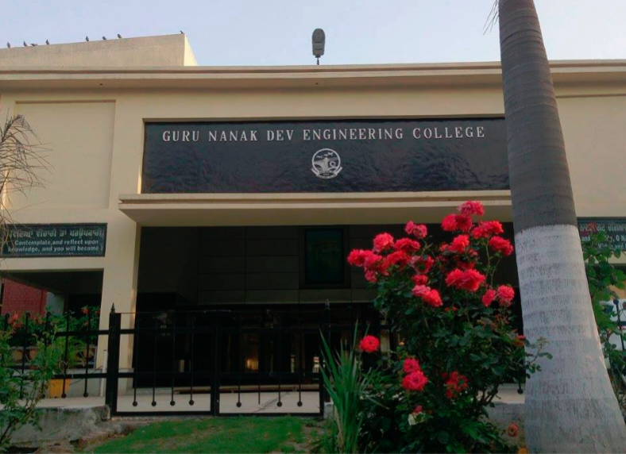

# Manju-devi883.github.io
**This is my first github page**
Hello one and all, firstly i introduce my self to you so first of all my name is manju devi from abohar fazilka ,punjab .I have to passed my 12th clads from Sen.sec.Residential school for meritorious student with 96%in science (Mathematics) stream . Currently I studing in Guru Nanak Dev engineering college, Ludhiana ❤️. I have come from trakki foundation.At the present my branch is Btech(CSE).Now I share my experience in GNDEC from 9 july ...Day by Day 

#FIRST DAY IN GNDEC, LUDHIANA 
firstly at gndec we visited at Gurudwara sahib for inauguration ceremony.Aftet kirtan and ardaas they provide us tea and sweets after that we were go to auditorium.There we met many faculty members.Mrs gurleen kaur an IPS officer at dehli came to our college and gave us huge round of knowledge.She told us about his struggle life and to much more .On that day we enjoy too much.It is a very powerful experience for me.thanks for this session

###2nd DAY IN GNDEC, LUDHIANA 
Today we came to know more about our guru nanak dev engineering college Ludhiana 
